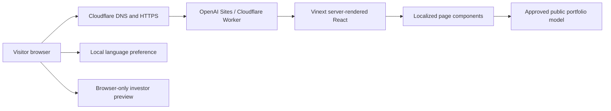

# Equis Nexus Website

Official source for the Equis Nexus corporate website and private investor
preview.

- Website: [equis-nexus.com](https://equis-nexus.com)
- Contact: [icontact@equis-nexus.com](mailto:icontact@equis-nexus.com)
- Legal entity: Equis Nexus 合同会社 (Godo Kaisha), Japan
- Project owner and copyright holder: Equis Nexus
- Repository custodian: the `nilpost` GitHub account
- License: proprietary; source visibility does not grant reuse rights
- Current version: `0.5.0`

## Status

The source repository is public as a clean, sanitized snapshot beginning with
version `0.5.0`. Earlier development history and pull-request discussions remain
in a separate private archive.

The deployed website remains an **owner-only private preview** while management,
legal, accounting, financial-data, and website-publication approval are
completed. Public source visibility does not make the hosted website public.

Future releases must follow
[`docs/publication-checklist.md`](docs/publication-checklist.md).

## What this project communicates

Equis Nexus is presented as a Japanese investment and asset-management platform
initially focused on acquiring, financing, owning, improving, and managing
Japanese real estate. The website combines that practical foundation with a
long-term vision of connecting Japan, real assets, international capital,
expertise, and new enterprise.

The current release includes:

- The company mission, vision, operating principles, and official name story
- A portfolio framework beginning with Jingumae Residence
- Public-disclosure controls for property facts and performance metrics
- A non-authenticating investor-access preview
- English, Catalan, Spanish, and Japanese versions of every public page
- Local browser-language preference with English fallback
- Localized metadata and language-alternate links
- Responsive layouts, accessible form behavior, and reduced-motion support

Release changes are recorded incrementally in [`CHANGELOG.md`](CHANGELOG.md).
The versioning and release rules are documented in
[`docs/versioning.md`](docs/versioning.md).

The approved public business source is
[`docs/equis-nexus-business-information.md`](docs/equis-nexus-business-information.md).

## Application routes

| Experience | English | Catalan | Spanish | Japanese |
|---|---|---|---|---|
| Company homepage | `/` | `/ca` | `/es` | `/ja` |
| Jingumae portfolio | `/portfolio/jingumae-residence` | `/ca/portfolio/jingumae-residence` | `/es/portfolio/jingumae-residence` | `/ja/portfolio/jingumae-residence` |
| Investor preview | `/investor-login` | `/ca/investor-login` | `/es/investor-login` | `/ja/investor-login` |

English is the fallback for unsupported browser languages. On a first visit to
the English route, the browser’s preferred supported language may be selected.
An explicit selection takes priority afterward and is kept only in local browser
storage under `equis-nexus-language`.

## Architecture



The application has no public database, authentication service, investor
accounts, analytics, cookies, or form-processing backend. The investor form
validates in the browser, clears the access code, and always displays a
preparation notice without transmitting or storing form values.

Portfolio fields are typed with approval and disclosure states. Rendering
helpers publish only records marked both `approved` and `public`. Financial
metrics also require a value, reporting date, and source before they can render.

See [`docs/architecture.md`](docs/architecture.md) for component boundaries,
data flow, localization, build output, deployment, and extension guidance.

## Technology

- Next.js-compatible React 19 application
- TypeScript 5
- Vinext and Vite
- Cloudflare Workers runtime
- OpenAI Sites deployment
- Cloudflare-managed DNS and HTTPS
- Node’s built-in test runner and ESLint

`"private": true` in `package.json` prevents accidental publication to the npm
registry. It is independent of GitHub repository visibility.

## Repository map

```text
.
├── .github/
│   └── CODEOWNERS
├── .openai/
│   └── hosting.json
├── app/
│   ├── components/              Shared page and interface components
│   ├── data/portfolio.ts        Typed asset and disclosure model
│   ├── i18n.ts                  Four-language content and route helpers
│   ├── localized-metadata.ts    Canonical and hreflang metadata
│   ├── ca/ es/ ja/              Localized route wrappers
│   └── ...                      English routes and global layout
├── build/
│   └── sites-vite-plugin.ts     Deployment metadata packaging helper
├── docs/
│   ├── architecture.md
│   ├── cloudflare-deployment.md
│   ├── equis-nexus-business-information.md
│   ├── publication-checklist.md
│   └── versioning.md
├── public/                      Manifest and approved visual assets
├── tests/                       Render, disclosure, and privacy tests
├── worker/                      Cloudflare runtime entrypoint
├── CHANGELOG.md
├── CONTRIBUTING.md
├── LICENSE
├── SECURITY.md
└── project-manifest.json
```

`.openai/hosting.json` contains only the non-secret Sites project identifier and
logical resource bindings. Runtime credentials and deployment tokens must never
be stored in the repository.

## Local development

Requirements:

- Node.js 22.13 or newer
- npm

Install and start:

```sh
npm install
npm run dev
```

The development server reports its local URL in the terminal.

## Validation

```sh
npm run lint
npm test
npm audit
```

`npm test` creates a production build and verifies:

- English and localized routes render correctly
- Portfolio disclosure rules withhold unapproved financial data
- Confidential address and financing patterns do not enter public HTML
- The investor preview has no password field or submission endpoint
- Language selection uses browser preference only as designed
- Localized metadata and route relationships are present
- Production and development dependencies have no known npm advisories

## Deployment

The validated Git commit is packaged and deployed through OpenAI Sites.
Cloudflare provides the custom-domain DNS records and HTTPS certificate.
Production access remains owner-only until an authorized Equis Nexus
representative explicitly approves public access.

Operational details and DNS safeguards are documented in
[`docs/cloudflare-deployment.md`](docs/cloudflare-deployment.md).

## Information governance

Do not commit or publish:

- Exact property or unit addresses
- Acquisition prices, capital amounts, debt, financing terms, or lenders
- Bank, tax, accounting, transaction, appraisal, or investor records
- Credentials, tokens, environment values, or account identifiers intended to
  remain private
- Personal contact information beyond approved company contact channels
- Unapproved claims about performance, clients, partners, licenses, or assets

The current portfolio contains no public financial values. Methodology labels
are visible, but values remain absent until their source, date, valuation
support, and publication approval are complete.

## Ownership, contributions, and reuse

Copyright © 2026 Equis Nexus. All rights reserved.

This is source-available company software, not an open-source project. Public
repository visibility, if approved, permits inspection only; it does not grant
permission to copy, modify, distribute, publish, sublicense, or sell the code,
design, content, or visual assets.

External contributions are not currently accepted. See
[`CONTRIBUTING.md`](CONTRIBUTING.md) and [`LICENSE`](LICENSE).
