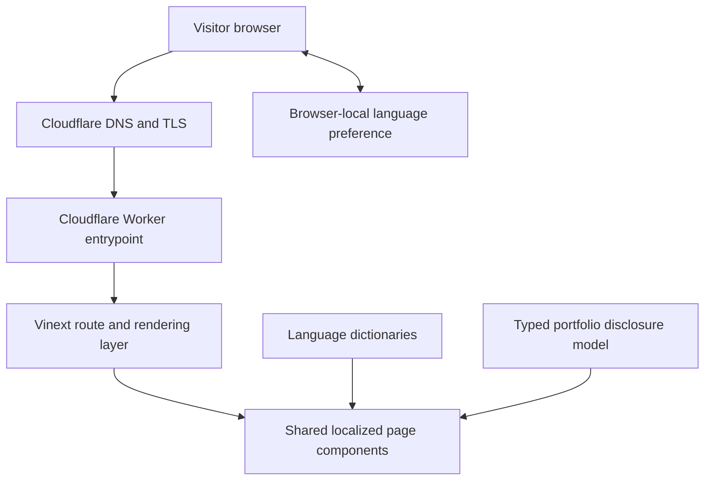

# Architecture

## Purpose

This document explains how the Equis Nexus website is structured, where its
content comes from, and which boundaries prevent private investor or property
information from entering the public interface.

## System overview

The project is a server-rendered React website built with the
Next.js-compatible Vinext toolchain and deployed to a Cloudflare Workers runtime
owned by the Equis Nexus Cloudflare account.



There is no application database, content-management system, authentication
backend, contact-form endpoint, analytics service, or investor-record store in
this release.

## Runtime boundaries

### Server-rendered content

The route wrappers select a locale and render one of three shared experiences:

- `HomePage`
- `AssetPage`
- `InvestorPage`

English routes live at the root. Catalan, Spanish, and Japanese wrappers live
under `/ca`, `/es`, and `/ja`. Shared rendering avoids duplicating page
structure while keeping every route statically discoverable.

### Browser-only behavior

Two components execute in the browser:

- `LanguageSwitcher` reads the browser language, remembers an explicit locale
  choice in local storage, and moves to the equivalent localized route.
- `LoginForm` performs native field validation, clears the access-code field,
  moves focus to an accessible notice, and makes no network request.

Only the language preference is stored locally. Investor-form values are never
stored, logged, sent, or placed in the URL.

## Content and localization

`app/i18n.ts` is the single source for visible English, Catalan, Spanish, and
Japanese copy. `app/localized-metadata.ts` provides localized page titles,
descriptions, canonical URLs, and `hreflang` alternates.

Locale behavior follows this order:

1. An explicit on-device choice takes priority.
2. A direct localized URL is respected when no explicit choice exists.
3. A first visit to `/` may use a supported browser language.
4. Unsupported or absent preferences fall back to English.

## Portfolio disclosure model

`app/data/portfolio.ts` defines typed asset records.

Every publishable fact has:

- A source
- An approval state
- A disclosure level
- An optional reporting date

The rendering layer selects facts only when:

```text
approval = approved
AND disclosure = public
```

Financial metrics must additionally contain a numeric value, source, and
reporting date. Valuation-dependent metrics remain absent until an independent
appraisal and publication approval exist.

This is a presentation safeguard, not a substitute for management, legal,
accounting, or financial review.

## Styling and assets

`app/globals.css` contains the responsive visual system, architectural
intersection motif, typography, reduced-motion behavior, portfolio graphics,
and investor-preview layouts.

Images in `public/` are company-approved or original project graphics. The
multilingual Open Graph image is used for social-sharing metadata. No property
photographs or private transaction documents are bundled.

## Build and deployment

The application build produces a Workers-compatible `dist/` directory. Build
artifacts are intentionally ignored by Git and are packaged only for deployment.

The release flow is:

1. Validate linting and tests.
2. Commit the exact reviewed source.
3. Merge the reviewed release into the public GitHub repository.
4. Let Cloudflare Workers Builds compile and deploy the exact `main` commit.
5. Verify the generated `workers.dev` address before changing the custom domain.
6. Verify all production routes from multiple regions after deployment.

Cloudflare manages DNS and HTTPS for `equis-nexus.com`. Existing email DNS
records are outside the website deployment and must not be changed as part of a
site release.

## Security and privacy boundaries

- Environment files, deployment output, local Workers state, and logs are
  ignored.
- Cloudflare and GitHub credentials are managed by their respective platforms
  and are never committed.
- `wrangler.jsonc` contains no secret account identifier or token.
- The investor preview has no authentication or data-submission capability.
- Exact financial values and investor records belong outside this repository.
- Public rendering tests reject confidential address and financing patterns.

See [`../SECURITY.md`](../SECURITY.md) for private vulnerability reporting.

## Extending the project

### Add a property

1. Add a typed asset record with source, approval, and disclosure metadata.
2. Add localized presentation copy for all four languages.
3. Create the route wrappers.
4. Extend the rendering and privacy tests.
5. Obtain publication approval before changing any field to `approved` and
   `public`.

### Add a language

1. Extend the locale type and language names.
2. Add a complete dictionary; do not ship partial machine-generated copy.
3. Add homepage, portfolio, and investor-preview route wrappers.
4. Add localized metadata and language alternates.
5. Add render and route-equivalence tests.

### Add real investor authentication

That is intentionally outside the current architecture. It would require a
separate security design covering identity, authorization, encrypted storage,
audit logging, privacy notices, retention, incident response, and legal review.

## Deliberate non-goals

- Public investor accounts
- Password handling
- Online investment solicitation
- Public exact financial disclosures
- Transaction-document hosting
- Analytics or behavioral tracking
- Automated investor-brief distribution
